# Intro

In Gaussian Splatting we carefully arrange a number of multi-variate Gaussians in space such that they represent a scene. Each Gaussian is assigned a color and can be rendered by evaluating it's probability density function. By carefully tuning each Gaussian's parameters to reconstruct ground truth views of the scene, it is possible to represent arbitrary scenes like the one in the two-dimensional example above. Extending this to the third dimension is particularly interesting because it allows us to render the scene from views that don't exist in the ground truth, allowing us to synthesize novel views.

This idea is introduced in the paper "3D Gaussian Splatting for Real-Time Radiance Field Rendering" [1] which we have reimplemented using the PyTorch library. The following will give an overview of the theory and implementation details.

# Theory

At the center of 3d Gaussian splatting lay two components:

* A set of **Gaussians** that are each described by an array of parameters that specify their position, shape, color, and opacity. These can be initialized randomly or using a point cloud generated by photogrammetric techniques like structure from motion [2].
* A set of **cameras/views** of the scene that we would like to reconstruct. This includes the ground truth image that has been recorded by the respective camera as well as the camera's intrinsic and extrinsic information.

Given these two, the objective is to optimize the values of the Gaussians' parameters s.t. they are maximally similar to the ground truth images when rendered by each of the cameras.

## Optimization Procedure

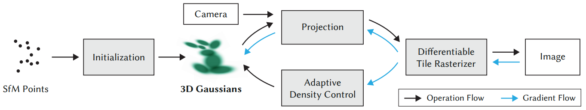
*Figure 1: Overview of the training pipeline as it is described in [1].*

Figure 1 illustrates the optimization procedure step by step:

1. One of the cameras is randomly selected and the Gaussians are projected onto it's uv-plane.
2. The scene is rendered by the differentiable rasterizer which produces an image.
3. The loss between the rendered image and the camera's ground truth is backpropagated trough the computational graph to update the gaussians parameters using gradient descent.

This procedure is repeated until the overall loss is minimized which results in the gaussians representing the original scene.

Note that the training procedure shown in figure 1 also includes an "Adaptive Density Control" component that regulates the amount of gaussians in the scene dynamically. For the sake of simplicity, we haven't implemented this component since it is not integral to the algorithm.

## Formalization of Gaussians

Before diving deeper into the theorethical details, we will first formalize how we are representing Gaussians: A Gaussian can be evaluated at a coordinate $\mathbf{x}$ using it's probability density function:

$$G(\pmb{x}) = N e^{- \frac{1}{2}(\pmb{x} - \pmb{\mu})^T \pmb{\Sigma}^{-1}(\pmb{x} - \pmb{\mu})}$$

with mean:

$$\pmb{\mu} = (\mu_x,\mu_y,\mu_z)^T, \text{where} x,y,z \in \mathbb{R}$$

covariance matrix:

$$\pmb{\Sigma} \in \mathbb{R}^{3 \times 3}$$

and normalization factor $N$.

Because the covariance matrix must be positive semi-definite, this property needs to be upheld during the optimization process. To achieve this it is decomposed into a rotation matrix $\mathbf{R}$ and a scaling matrix $\mathbf{S}$ which can be optimzed independently without a constraint and from which a positive semi-definite covariance matrix can be reconstructed:

$$\pmb{\Sigma} = \mathbf{R}\mathbf{S}\mathbf{S}^T\mathbf{R}^T.$$

$\mathbf{S}$ can be condensed into $\mathbf{s}=(s_x, s_y, s_z)^T$ and likewise $\mathbf{R}$ can be represented by a quaternion $\mathbf{s}=(q_x, q_y, q_z, q_w)^T$.

Next, we also need to assign a color value to the Gaussian. In the reference implementation this is realized using spherical harmonics. This allows to not only represent a static color value but a viewing angle dependent color. However for the sake of simplicity we will model the color using a single RGB color value:

$$\mathbf{c} = (r,g,b),~\text{where}~ r,g,b \in [0,1].$$

Finally we note that because of the normalization constant $N$, the opacity of the Gaussian will change with it's covariance matrix. To disentangle the opacity from the covariance we omit the normalization and instead replace it with an opacity parameter:

$$o \in [0,1].$$

As a result we define the following representation of a Gaussian:

$$\mathbf{g} = (\pmb{\mu}, \mathbf{s}, \mathbf{q}, \mathbf{c}, o)^T \in \mathbb{R}^{14}$$

(Note: $\mathbf{c}$ and $o$ are clipped into the correct range during rendering.)

## Rendering

This section goes over the render process that consists of the projection and rasterization steps:

### Projection

Let $\mathbf{K}$ be the pinhole projection matrix. Then the projection of the mean is computed as

$$\pmb{\mu}\_{\text{2D}} = \begin{bmatrix}x'/z' \\ y'/z'\end{bmatrix} , \begin{bmatrix} \mu_x' \\ \mu_y'\\ \mu_z'\end{bmatrix}= \mathbf K \begin{bmatrix}\mu_x \\ \mu_y\\ \mu_z\end{bmatrix}.$$

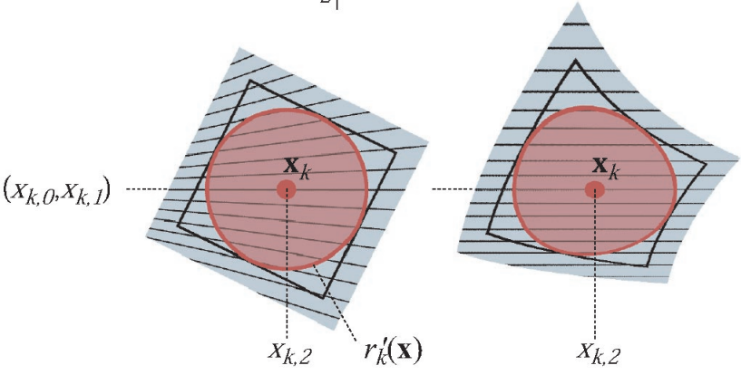
*Figure 2: Applying $\mathbf{K}$ directly (Figure from [3])*

Since the pinhole projection is not an affine transformation, the result of applying it directly to the 3D-Gaussian will not result in a 2D-Gaussian (as illustrated in Figure 2).

Therefore we are performing an affine approximation at the respective Gaussian's mean with:

$$ \pmb{\Sigma}\_{\text{2D}} = \mathbf{J}\pmb{\Sigma}\mathbf{J}^T $$

where

$$ \mathbf{J}(\pmb{\mu}) = \begin{bmatrix}
\frac{f_x}{\mu_z} & 0 & -\frac{f_x\mu_x}{\mu_z^2} \\
0 & \frac{f_y}{\mu_z} & -\frac{f_y\mu_y}{\mu_z^2} \\
\end{bmatrix}
$$

and $\mathbf{f} = (f_x, f_y)^T$ is the cameras focal point (as described in [3]).

Note: The calculations above assume that the camera is positioned at the origin. Otherwise both transformations $\mathbf{K}$ and $\mathbf{J}$ must be right hand multiplied with the world-to-camera transform.

### Rasterization

Once the Gaussians have been projected to the uv-plane, they can be rasterized by performing alpha blending. This is done with the following formula:

$$
C(\mathbf{x})=\sum\_{i \in \mathcal{N}} c_i \alpha_i \prod\_{j=1}^{i-1}\left(1-\alpha_j\right).
$$

It states that the color value $C$ at a pixel coordinate $\mathbf{x}$ is computed by blending each Gaussians color weighted by it's alpha value iterating from the closest to the farthest Gaussian in the set of depth-sorted Gaussians $\mathcal{N}$. The overall transparency $\alpha_i$ is computed as

$$ \alpha_i = o_i G(x).$$

### Tile Based Rendering

Because the density of a Gaussian outside of a certain range will be very close to zero, it's contribution to the color value of a pixel will be negligible if the pixel's coordinate is outside of that range. With tile based rendering we are exploiting this property by only including these Gaussians into the computation of a pixels color value that are within approximately three times the standard deviation of that Gaussian.

To achieve this, the canvas is first partitioned into square tiles. An oriented bounding box is computed to encapsulate every Gaussian and the Gaussians are sorted into the tiles where a Gaussian is assigned to each tile that it's bounding box intersects. Then the pixels color values can be computed on a per tile basis only for the assigned Gaussians, significantly reducing computational complexity.

### Computing the Bounding-Box

Given a 2x2 Covariance Matrix

$$\mathbf{A} = \begin{bmatrix}
a & b\\
b & c
\end{bmatrix}$$

it's eigenvalues can be computed as

$$
\lambda\_1, \lambda\_2 = \frac{1}{2} (a + d\pm\sqrt{  a^2 - 2ad + 4b^2 + d^2}).
$$

and the orientation can be computed as

$$
\theta = \begin{cases}
0 & b = 0 \land a \geq c \\
\frac{\pi}{2} & b = 0 \land a \lt c \\
atan2(\lambda\_1 - a, b) & \text{else}
\end{cases}
$$

from which we construct the rotation matrix

$$\mathbf{R} = \begin{bmatrix}
cos(\theta) & -sin(\theta)\\
sin(\theta) & cos(\theta)
\end{bmatrix}.$$

Then, we construct a rectangle with the radii $r\_1 = \sqrt{\lambda\_1}$ and $r\_2 = \sqrt{\lambda\_2}$ and rotate it using the rotation matrix to get the final bounding-box.

# Implementation

The following section gives an overview of our implementation of the 3DGS algorithm.

We have chosen to implemented the complete algorithm in PyTorch because of the following features it provides:

*   All standard PyTorch operations have their gradient computation preimplemented and using its autograd feature, any calculations gradient can be obtained automatically if the calculation is composed of these standard operations.
*   PyTorch provides features like broadcasting that allow vectorization of computations to execute them in parallel on the GPU.
*   We can make use of PyTorch's training API.

We have implemented a Renderer as a torch module by inheriting from nn.Module and divided the forward pass into three main functons:

`_project_gaussians`: Projects the 3D-Gaussians onto a given camera's uv-plane and also performs a global sorting operation according to the Gaussians' depth.

`_tile_gaussians`: Computes bounding-boxes and assigns them to tiles according to them. Produces a tile-map which contains the gaussians assigned to each tile.

`_rasterize_tile_fast`: Computes color values for all pixels of a fiven tile in a vectorized fashion. This function is called sequentially for each tile.

All operations can be implemented following the calculation in the [theory section](#theory) using standard pytorch operations like torch.matmul, torch.mul, torch.sort, and others which makes the rendering module automatically differentiable. In the next step we have implemented the training pipeline shown in [Figure 1](#optimization-procedure) using PyTorch's training API where we can instanciate and call the renderer as a standard Pytorch module.

## Limitations

A limiting factor of our implementation is that we are only vectorizing the rasterization on a per-tile basis and sequentially call **_rasterize_tile_fast** on each tile. This is due to the fact that there is a varying amount of gaussians assigned to each tile which results in a jagged array for the tile-map. To our knowleadge PyTorch does not support vectorization of jagged arrays via torch.vmap or other ways, which forces us to perform the computation sequentially. This leads to a significantly lower execution speed compared to the reference implementation.

# Results

In this section we showcase some of the experiments and their results:

## Experiments

To evaluate our implementation, we are runnining experiments on some of the NeRF Synthetic Datasets [4]. All experiments are perfomed at a resolution of 512 x 512 pixels with 5,000 Gaussians whose means are randomly initialized and remaining parameters are set constant. We are using an RTX 2070 Super with 8GB of video memory.

### Performance

First we are evaluating the perfomance of the forward and backward passes at various tile sizes:

| Tile Size | Mean Forward | Mean Backward | Mean Total |
| :--- | :--- | :--- | :--- |
| 8 | 1.304s | 1.357s | 2.661s |
| 16 | 0.503s | 0.397s | 0.9s |
| **32** | **0.362s** | **0.472s** | **0.834s** |
| 64 | 0.471s | 1.148s | 1.619s |

We are measuring the best overall perfomance at a tile size of 32.

### Qualitative Results

Below we are showcasing some of the results we have produced and discussing them. All experiments are following the previously mentioned settings and are run for 5,000 iterations each.

#### Hotdog

| Training | Final | Ground Truth |
| :---: | :---: | :---: |
| 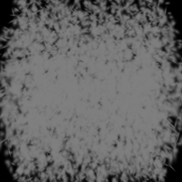 | 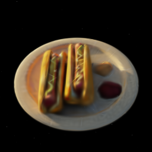 | 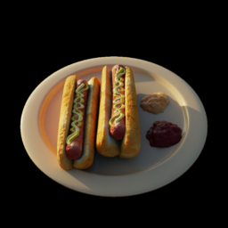 |

One noticable difference in this example is that the specular reflections on the sauces next to the hotdog seem to be missing. This kind of direction specific coloring is modeled with the use of spehiracl harmonics in the reference implementation. Another noticable difference is that finer details like the texture of the bread are not very well represented in our reconstruction. Due to hardware limitations we are using a relatively small amount of Gaussians. This is likely causing smaller details to be "overreconstructed" by a single larger Gaussian. This case is handled by the "adaptive density controll" component in the reference implementation by splitting the Gaussian. Similar things are observable in the remaining examples.

#### Ficus

| Training | Final | Ground Truth |
| :---: | :---: | :---: |
| 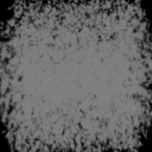 | 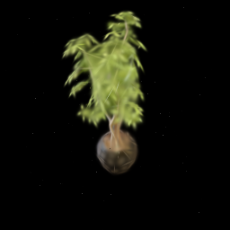 | 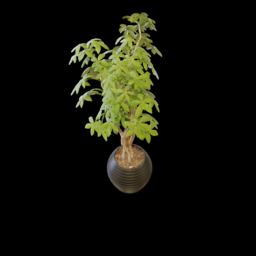 |

#### Materials

| Training | Final | Ground Truth |
| :---: | :---: | :---: |
| 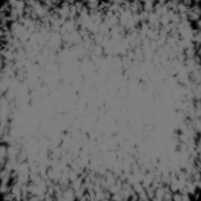 | 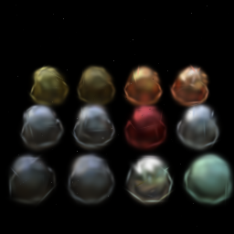 | 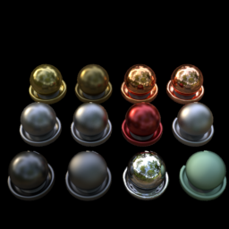 |

# References

[1] Kerbl, Bernhard, et al. "3D Gaussian Splatting for Real-Time Radiance Field Rendering." ACM Trans. Graph. 42.4 (2023): 139-1.

[2] Westoby, Matthew J., et al. "‘Structure-from-Motion’photogrammetry: A low-cost, effective tool for geoscience applications." Geomorphology 179 (2012): 300-314.

[3] Zwicker, Matthias, et al. "EWA splatting." IEEE Transactions on Visualization and Computer Graphics 8.3 (2002): 223-238.

[4] Mildenhall, Ben, et al. "Nerf: Representing scenes as neural radiance fields for view synthesis." Communications of the ACM 65.1 (2021): 99-106.
